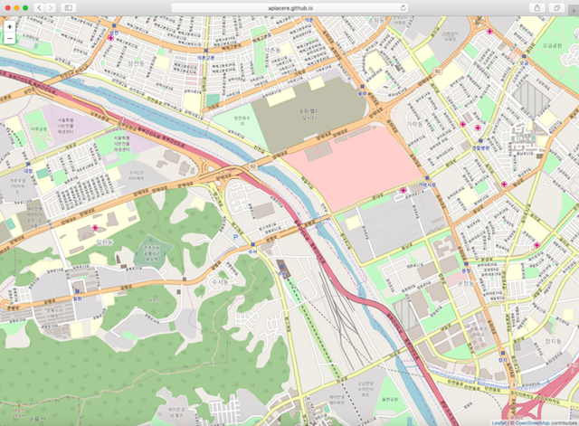

# OpenStreetMap Example
React web app using OpenStreetMap API

## Reference
[Leaflet Quick Start Guide](https://leafletjs.com/examples/quick-start)

## Environment
* OSX High Sierra 10.13.6
* npm 6.4.1
* node 8.12.0

## Result
[Github io link](https://apiacere.github.io/openstreetmap-example/)
